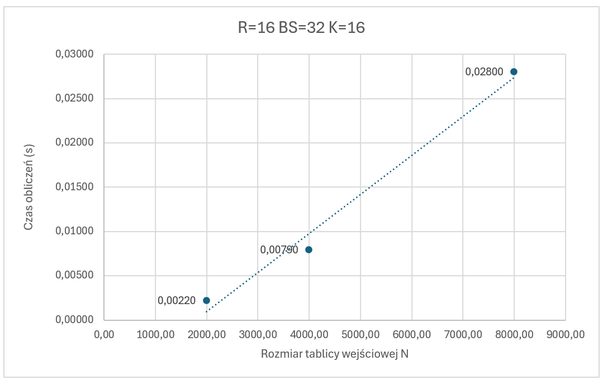

# Programowanie Równoległe - CUDA

Wersja pierwsza

### Autorzy

**Grupa dziekańska:** 4  
**Grupa labolatoryjna:** 7  
**Termin zajęć:** czwartek, 16:50

Tymoteusz Jagła 151811 - tymoteusz.jagla@student.put.poznan.pl  
Kaper Magnuszewski 151746 - kacper.magnuszewski@student.put.poznan.pl

### Sprawozdanie

_Wymagany termin oddania sprawozdania -_ 31.05.2024
_Rzeczywisty termin oddania sprawozdania -_ 31.05.2024  

Wersja poprawiona -_ 17.06.2024

## Cel zadania
Celem ćwiczenia jest praktyczne zapoznanie z zasadami programowania równoległego procesorów kart graficznych (PKG), zapoznanie z zasadami optymalizacji kodu dla PKG oraz ocena prędkości przetwarzania przy użyciu PKG i poznanie czynników warunkujących realizację efektywnego przetwarzania.

## Opis zadania

Zadanie polega na sumowaniu wartości tablicy o wielkości $N \times N$, które znajdują się w określonym przez „promień” $R$ obszarze. Tablica wynikowa ma rozmiar $(N-2R) \times (N-2R)$, sumy obliczane są dla wszystkich pozycji w odległości większej lub równej $R$ od krawędzi tablicy wejściowej.

Tablica Dwuwymiarowa $TAB[N][N]$ (o wierszu długości $N$, słowo tablicy $TAB[i][j]$ jest dostępne jako $TAB[i \cdot N+j]$). Dla tablicy wejściowej $TAB$ należy wyliczyć tablicę wyjściową $OUT[N-2R][N-2R]$ (gdzie $N>2R$)
zawierającą sumy elementów w „promieniu” $R$. Każdy element tablicy wyjściowej to suma $(2 \cdot R+1) \cdot (2 \cdot R+1)$ wartości.

Przykładowo dla $R=1$ $OUT[i][j]=TAB[i][j]+ TAB[i][j-1]+ TAB[i][j+1]+ TAB[i-1][j-1]+ TAB[i-1][j]+TAB[i-1][j+1]+ TAB[i+1][j]+ TAB[i+1][j-1]+ TAB[i+1][j+1]$.

## Wykorzystany system obliczeniowy

### Procesor (CPU)

- Model: 13th Gen Intel® Core(TM) i5-13600KF
- Liczba procesorów fizycznych: 14
  - 6 Performance-cores
  - 8 Efficient-cores
- Liczba procesorów logicznych: 20
  - 2 wątki na pojedyńczy Performance-core
  - 1 wątek na pojedyńczy Effitient-core
- Oznaczenie typu procesora: KF
- Taktowanie procesora:
  - Minimalne: 800MHz
  - Maksymalne: 51000MHz
- Wielkości pamięci podręcznej procesora: 
  - L1d cache: 544 KiB (14 instancji)
  - L1i cache: 704 KiB (14 instancji)
  - L2 cache: 20 MiB (8 instancji)
  - L3 cache: 24 MiB (1 instancja)
- Organizacja pamięci podręcznej: Intel® Smart Cache

### Jednostka przetwarzania graficznego (GPU)
 
 - Model: NVIDIA GeForce RTX 4070 SUPER 12G VENTUS 2X OC 
 - Nazwa technologii: Ada Lovelace
 - Producent: Micro-Star International
 - Układ graficzny: AD104-350
 - Parametr CUDA compute capability: 8.9
 - Liczba tranzystorów: 35.800 milionów
 - Proces technologiczny: 5nm
 - Rdzenie CUDA: 7168
 - Jednostki TMU: 224
 - Jednostki ROP: 80
 - Jednostki RT: 56
 - Jednostki Tensor: 224
 - Pamięć VRAM: 12 GB GDDR6X
 - Magistrala pamięci: 192-bitowa
 - Taktowanie pamięci: 1313 MHz
 - Taktowanie pamięci efektywne: 21000 MHz
 - Przepustowość pamięci: 504 GB/s
 - Taktowanie rdzenia (bazowe): 1980 MHz
 - Taktowanie rdzenia (boost): 2505 MHz
 - Pamięć cache L2: 48 MB
 - Pobór mocy (TGP): 220 W
 - Wersja sterownika: NVIDIA 551.61

### System Operacyjny

- Nazwa systemu operacyjnego: Microsoft Windows 11 N
- Oprogramowanie wykorzystane do przygotowania kodu wynikowego: Visual Studio 2022
- Oprogramowanie wykorzystane do przeprowadzenia testów: NVIDIA Nsight Compute 2024.02

## Wersje programów

### Wykorzystane zmienne:
 - $N$ - wielkość wymiaru tablicy wejściowej
 - $R$ - promień, w jakim realizowane jest sumowanie
 - $K$ - liczba wyników obliczanych przez jeden wątek
 - $BS$ - wielkość wymiaru bloku wątków
 - $tab[N \cdot N]$ - tablica wejściowa o wielkości $N*N$
 - $out[(N-2R)\cdot(N-2R)]$ - tablica wyjściowa o wielkości $(N-2R)\cdot(N-2R)$

### Algorytm rozwiązujący problem sekwencyjnie dla głównego procesora komputera
Poniższa funkcja to część programu, która służy obliczeniom sekwencyjnym (wykorzystuje jeden wątek) przy użyciu głównego procesora komputera. Zewnętrzne pętle programu z zmiennymi iteracyjnymi $i$ oraz $j$ wskazują na kolejne pola tablicy wejściowej, dla których będziemy przeprowadzali sumowanie. Pola w odległości mniejszej od $R$ są pomijane ze względu na niemożliwe przeprowadzenie sumy, gdy pola w zasięgu promienia wychodzą poza obszar tablicy. Pętle wewnętrzne wyznaczające $x$ i $y$ wskazują na kolejne pola występujące w obrębie promienia sumowania, kolejno odczytywane są wartości tablicy wejściowej na wskazanych indeksach, a następnie zwiększana jest wartość sumy dla komórki tablicy wyjściowej. Gdy zsumowane zostaną wszystkie pola w obrębie promienia $R$ wartość sumy $sum$ zapisywana jest do tablicy wyjściowej.  

  ***Kod 1. Obliczenia sekwencyjne***
~~~ { #K1 .cpp .numberLines caption="Kod 1. Obliczenia sekwencyjne"}

void sequential(float tab[N*N], float out[(N-2*R)*(N-2*R)])
{
	for (int i = R; i < N - R; i++) {
		for (int j = R; j < N - R; j++) {
			float sum = 0;
			for (int x = i - R; x <= i + R; x++) {
				for (int y = j - R; y <= j + R; y++) {
					sum += tab[x * N + y];
				}
			}
			out[(i - R) * (N - 2 * R) + j - R] = sum;
		}
	}
}
~~~

### Algorytm rozwiązujący problem równolegle wykorzystujący pamięć globalną
Poniższy kernel służy obliczeniom równoległym przy użyciu technologii CUDA procesora graficznego. Algorytm efektywnie wykorzystuje dane w pamięci globalnej karty - wątki dzięki przesunięciu w pionie kolejnych k obliczeń wątku realizują jednocześnie dostępy do sąsiednich elementów w pamięci globalnej. Wartości $i$ i $j$ są indeksami określającymi pozycję w tablicy wynikowej, wyliczane są na podstawie indeksu wątku, indeksu bloku, a także wymiaru bloku. Wartość $j$ jest dodatkowo przemnażana przez zmienną $kkk$, która odpowiada parametrowi $K$ - liczbie komórek tablicy wyjściowej przetwarzanej przez pojedynczy wątek. Pierwsza pętla przechodzi po wartościach $k$, które oznaczają kolejne komórki tablicy wynikowej przetwarzane przez wątek. Następnie dwie wewnętrzne pętle ustalają wartości $y$ i $x$, które służą do odczytu wartości w promieniu $R$ w tablicy wejściowej. Po odczycie wartości sumowanej komórki zwiększana jest lokalna zmienna $sum$, która następnie jest wpisywana w odpowiadające miejsce w tablicy wyjściowej. Ze względu wykorzystanie przesunięcia $k$ (kolejnych obliczanych komórek tablicy wyjściowej) w powiązaniu z wartością j, kolejne obliczane komórki przesunięte są w pionie. Dzięki temu sąsiednie wątki w wiązce korzystają ze wspólnych danych, ograniczając liczbę koniecznych odczytów z pamięci.

  ***Kod 2. Obliczenia przy użyciu CUDA***
~~~ { #K2 .cpp .numberLines caption="Kod 2. Obliczenia CUDA"}
__global__ void localKernel(float* tab, float* out, int* kkk)
{
    int i = threadIdx.x + blockIdx.x * blockDim.x;
    int j = (threadIdx.y + blockIdx.y * blockDim.y) * (*kkk);

    for (int k = 0; k < *kkk; k++) {
      float sum = 0;
      if (i < OUTSIZE && j + k < OUTSIZE) {
        for (int y = 0; y <= 2 * R; y++) {
          int jyk = (j + y + k) * N;
          for (int x = 0; x <= 2 * R; x++) {
            sum += tab[jyk + (i + x)];
          }
        }
        out[(j + k) * (OUTSIZE) + i] = sum;
      }
    }
}
~~~

### Wywołanie procedury kernela

Poniższy kod odpowiada za wywołanie procedury kernela wykorzystywanego to przeprowadzenia obliczeń. Kolejno ustawiane jest urządzenie GPU, alokowana jest pamięć karty graficznej, do której skopiowane zostaną tablice wejściowa i wyjściowa, a następnie tablica wejściowa kopiowana jest z urządzenia host'a do pamięci karty graficznej. Kernel wywoływany jest za pomocą polecenia `localKernel <<< blocksMatrix, threadsMatrix >>>(dev_tab, dev_out);`, podawana jest macierz bloków o wymiarach $ceil(OUTSIZE / BLOCKSIZE) / ceil(OUTSIZE / BLOCKSIZE / K)$, gdzie $OUTSIZE$ jest równe wartości $N-2R$ - wielkości krawędzi tablicy wynikowej. Macierz bloków uwzględnia wykonywanie obliczeń dla kilku komórek tablicy $out$ przez jeden wątek - jeden z wymiarów jest dzielony przez wartość $K$.

Po wywołaniu kernela sprawdzane jest czy wystąpiły błędy, następuje synchronizacja - oczekiwanie na zakończenie wywoływania kernela na GPU, po synchronizacji kopiowane są wartości tablicy wynikowej $dev_out$ znajdującej się w pamięci karty graficznej do tablicy $out$ na urządzeniu hosta.

  ***Kod 3. Wywołanie kernela***
~~~ { #K3 .cpp .numberLines caption="Kod 2. Wywołanie kernela"}
cudaError_t sumLocalWithCuda(float* tab, float* out) 
{
    float* dev_tab = 0;
    float* dev_out = 0;
    cudaError_t cudaStatus;

    cudaStatus = cudaSetDevice(0);
    if (cudaStatus != cudaSuccess) {
        fprintf(stderr, "cudaSetDevice failed!  Do you have a CUDA-capable GPU installed?");
        goto Error;
    }

    cudaStatus = cudaMalloc((void**)&dev_tab, N * N * sizeof(float));
    if (cudaStatus != cudaSuccess) {
        fprintf(stderr, "cudaMalloc failed!");
        goto Error;
    }

    cudaStatus = cudaMalloc((void**)&dev_out, (OUTSIZE) * (OUTSIZE) * sizeof(float));
    if (cudaStatus != cudaSuccess) {
        fprintf(stderr, "cudaMalloc failed!");
        goto Error;
    }

    cudaStatus = cudaMemcpy(dev_tab, tab, N*N * sizeof(float), cudaMemcpyHostToDevice);
    if (cudaStatus != cudaSuccess) {
        fprintf(stderr, "cudaMemcpy failed!");
        goto Error;
    }

    dim3 threadsMatrix(BLOCK_SIZE, BLOCK_SIZE);
    dim3 blocksMatrix(ceil((OUTSIZE) / (float)BLOCK_SIZE / K), ceil((OUTSIZE) / (float)BLOCK_SIZE));

    localKernel<<< blocksMatrix, threadsMatrix >>>(dev_tab, dev_out);

    // Check for any errors launching the kernel
    cudaStatus = cudaGetLastError();
    if (cudaStatus != cudaSuccess) {
        fprintf(stderr, "local launch failed: %s\n", cudaGetErrorString(cudaStatus));
        goto Error;
    }
    
    // cudaDeviceSynchronize waits for the kernel to finish, and returns
    // any errors encountered during the launch.
    cudaStatus = cudaDeviceSynchronize();
    if (cudaStatus != cudaSuccess) {
        fprintf(stderr, "cudaDeviceSynchronize returned error code %d after launching addKernel!\n", cudaStatus);
        goto Error;
    }

    cudaStatus = cudaMemcpy(out, dev_out, (OUTSIZE) * (OUTSIZE) * sizeof(float), cudaMemcpyDeviceToHost);
    if (cudaStatus != cudaSuccess) {
        fprintf(stderr, "cudaMemcpy failed!");
        goto Error;
    }

    Error:
    cudaFree(dev_tab);
    cudaFree(dev_out);
    
    return cudaStatus;
}
~~~

## Opis wykonania zadania

### Generowanie wartości testowych i sprawdzanie poprawności obliczeń
Do generowania wartości testowych użyliśmy liczb rzeczywistych pseudolosowych generowanych za pomocą funkcji `rand()` z biblioteki standardowej. Aby przetestować poprawność obliczeń przy użyciu algorytmu rozwiązującego problem równolegle porównywaliśmy za każdym razem jego wyjście do wyjścia funkcji obliczającej wartości tablicy sekwencyjnie. Ostateczna wersja algorytmu równoległego była w stanie rozwiązać zadany problem obliczeniowy poprawnie przy każdej próbie.

### Użyte miary wydajności
Użytymi przez nas miarami wydajności był czas jaki zajęły obliczenia, ilość GigaFLOP'ów / s oraz ilość FLOP'ów  / Bajt. 

Do obliczenia ilości flopów w naszym algorytmie użyliśmy wzoru: $(N-2R)^2 \cdot (2R + 1)^2$, gdzie $(N-2R)^2$ to rozmiar tablicy wynikowej, a $(2R + 1)^2$ to ilość operacji wykonywanych dla jednej komórki tablicy wynikowej. 

Do wyznaczenia miary GFLOP / s użyliśmy wzoru: $\frac{FLOP}{1e9 \cdot t}$, gdzie FLOP, to ilość flop'ów obliczona za pomocą poprzedniego wzoru, a $t$ to czas jaki zajęły obliczenia.

Ostatnią użytą przez nas miarą wydajności była ilość FLOP'ów / B. Wyniki zapisane w poniższych pomiarach zostały wygenerowane przez używane przez nas oprogramowanie - NVIDIA Nsight Compute. Nie wykorzystaliśmy wyników własnych obliczeń, ponieważ miara ta jest zależna od sposobu korzystania z pamięci globalnej karty. Kernel w naszym projekcie napisany został w taki sposób, aby wykorzystywać tę pamięć bardzo efektywnie. Oznacza to, że wątki realizują jednocześnie dostępy do sąsiadujących ze sobą w pamięci globalnej elementów tablicy (koalescencja dostępu do pamięci globalnej). Dzięki temu dostępy do pamięci karty są łączone. Oznacza to, że obliczane przez nas FLOP'y / B nie są wartością prawdziwą, ponieważ rozpatrzamy jedynie najgorszy możliwy przypadek. Wzór jakiego użyliśmy to: $\frac{FLOP}{(N-2R)^2 \cdot \{(2R+1)^2+1\} \cdot sizeof(float)}$, gdzie FLOP oznacza ilość flop'ów, $(N-2R)^2$ to rozmiar tablicy wynikowej, $\{(2R + 1)^2+1\}$ to liczba operacji wykonywanych dla jednej komórki tablicy wynikowej wraz z zapisem do niej obliczonej sumy.

## Zobrazowanie problemu

***Schemat 1. Miejsce dostępu i kolejność dostępu do danych realizowane przez poszczególne wątki i bloki***

***Schemat 2. Wartości wyników wyznaczane przez bloki i wątki***

## Pomiary

### Tabele

***Tabela 1. $N = 2000, R = 4$***

| Wariant         | K  | BlockSize | Czas   | GFLOP/s   | FLOP/B |
|-----------------|----|-----------|--------|-----------|--------|
| 0 - Sekwencyjny | -  | -         | 0.0650 | 4.9448    | -      |
| 1               | 1  | 8         | 0.0003 | 992.9967  | 20,08  |
| 2               | 4  | 8         | 0.0004 | 789.3871  | 19,88  |
| 3               | 16 | 8         | 0.0004 | 793.4404  | 19,45  |
| 4               | 1  | 16        | 0.0003 | 1129.5729 | 12,57  |
| 5               | 4  | 16        | 0.0003 | 1084.9170 | 19,68  |
| 6               | 16 | 16        | 0.0002 | 1452.5181 | 20,08  |
| 7               | 1  | 32        | 0.0003 | 1106.4290 | 12,37  |
| 8               | 4  | 32        | 0.0002 | 1490.6741 | 19,74  |
| 9               | 16 | 32        | 0.0002 | 1429.1637 | 20,08  |

***Tabela 2. $N = 2000, R = 8$***

| Wariant         | K  | BlockSize | Czas   | GFLOP/s   | FLOP/B |
|-----------------|----|-----------|--------|-----------|--------|
| 0 - Sekwencyjny | -  | -         | 0.3340 | 3.4059    |        |
| 1               | 1  | 8         | 0.0008 | 1458.8523 | 46,68  |
| 2               | 4  | 8         | 0.0011 | 1037.5423 | 46,24  |
| 3               | 16 | 8         | 0.0012 | 912.9019  | 25,24  |
| 4               | 1  | 16        | 0.0006 | 1886.8061 | 71,07  |
| 5               | 4  | 16        | 0.0006 | 1867.1838 | 44,02  |
| 6               | 16 | 16        | 0.0007 | 1713.7155 | 39,13  |
| 7               | 1  | 32        | 0.0006 | 1774.9805 | 71,07  |
| 8               | 4  | 32        | 0.0006 | 1962.8576 | 49,19  |
| 9               | 16 | 32        | 0.0006 | 1819.0304 | 71,07  |

***Tabela 3. $N = 2000, R = 16$***

| Wariant         | K  | BlockSize | Czas   | GFLOP/s   | FLOP/B |
|-----------------|----|-----------|--------|-----------|--------|
| 0 - Sekwencyjny | -  | -         | 1.5750 | 2.6779    | -      |
| 1               | 1  | 8         | 0.0028 | 1517.2014 | 207,18 |
| 2               | 4  | 8         | 0.0041 | 1033.8449 | 52,93  |
| 3               | 16 | 8         | 0.0042 | 994.7010  | 205,76 |
| 4               | 1  | 16        | 0.0025 | 1657.6391 | 92,07  |
| 5               | 4  | 16        | 0.0020 | 2086.1312 | 161,49 |
| 6               | 16 | 16        | 0.0023 | 1814.4553 | 161,18 |
| 7               | 1  | 32        | 0.0020 | 2061.8514 | 165,23 |
| 8               | 4  | 32        | 0.0020 | 2130.4732 | 119,94 |
| 9               | 16 | 32        | 0.0022 | 1901.9313 | 261,20 |

***Tabela 4. $N = 4000, R = 4$***

| Wariant         | K  | BlockSize | Czas   | GFLOP/s   | FLOP/B |
|-----------------|----|-----------|--------|-----------|--------|
| 0 - Sekwencyjny | -  | -         | 0.2700 | 4.7808    | -      |
| 1               | 1  | 8         | 0.0014 | 952.4949  | 10,12  |
| 2               | 4  | 8         | 0.0013 | 972.0507  | 10,57  |
| 3               | 16 | 8         | 0.0013 | 966.7392  | 11,68  |
| 4               | 1  | 16        | 0.0008 | 1543.3946 | 11,79  |
| 5               | 4  | 16        | 0.0008 | 1699.2358 | 12,06  |
| 6               | 16 | 16        | 0.0008 | 1603.0744 | 11,68  |
| 7               | 1  | 32        | 0.0008 | 1526.1108 | 11,69  |
| 8               | 4  | 32        | 0.0007 | 1853.0945 | 11,97  |
| 9               | 16 | 32        | 0.0008 | 1708.1584 | 9,38   |

***Tabela 5. $N = 4000, R = 8$***

| Wariant         | K  | BlockSize | Czas   | GFLOP/s   | FLOP/B |
|-----------------|----|-----------|--------|-----------|--------|
| 0 - Sekwencyjny | -  | -         | 1.3780 | 3.3288    | -      |
| 1               | 1  | 8         | 0.0044 | 1036.5332 | 41,82  |
| 2               | 4  | 8         | 0.0043 | 1062.5723 | 41,05  |
| 3               | 16 | 8         | 0.0046 | 989.7009  | 37,47  |
| 4               | 1  | 16        | 0.0025 | 1816.6027 | 42,98  |
| 5               | 4  | 16        | 0.0023 | 2023.7792 | 41,95  |
| 6               | 16 | 16        | 0.0026 | 1792.6804 | 41,82  |
| 7               | 1  | 32        | 0.0024 | 1922.1508 | 32,26  |
| 8               | 4  | 32        | 0.0022 | 2054.3492 | 41,79  |
| 9               | 16 | 32        | 0.0023 | 2010.2416 | 42,98  |

***Tabela 6. $N = 4000, R = 16$***

| Wariant         | K  | BlockSize | Czas   | GFLOP/s   | FLOP/B |
|-----------------|----|-----------|--------|-----------|--------|
| 0 - Sekwencyjny | -  | -         | 6.3560 | 2.6977    | -      |
| 1               | 1  | 8         | 0.0158 | 1082.0573 | 98,90  |
| 2               | 4  | 8         | 0.0163 | 1050.7608 | 116,93 |
| 3               | 16 | 8         | 0.0170 | 1006.4650 | 122,24 |
| 4               | 1  | 16        | 0.0090 | 1910.6641 | 96,25  |
| 5               | 4  | 16        | 0.0081 | 2115.6857 | 139,25 |
| 6               | 16 | 16        | 0.0092 | 1871.5433 | 120,22 |
| 7               | 1  | 32        | 0.0079 | 2178.7440 | 112,03 |
| 8               | 4  | 32        | 0.0078 | 2201.5895 | 122,75 |
| 9               | 16 | 32        | 0.0079 | 2165.9561 | 129,35 |

***Tabela 7. $N = 8000, R = 4$***

| Wariant         | K  | BlockSize | Czas   | GFLOP/s   | FLOP/B |
|-----------------|----|-----------|--------|-----------|--------|
| 0 - Sekwencyjny | -  | -         | 6.3560 | 2.6977    | -      |
| 1               | 1  | 8         | 0.0158 | 1082.0573 | 98,90  |
| 2               | 4  | 8         | 0.0163 | 1050.7608 | 116,93 |
| 3               | 16 | 8         | 0.0170 | 1006.4650 | 122,24 |
| 4               | 1  | 16        | 0.0090 | 1910.6641 | 96,25  |
| 5               | 4  | 16        | 0.0081 | 2115.6857 | 139,25 |
| 6               | 16 | 16        | 0.0092 | 1871.5433 | 120,22 |
| 7               | 1  | 32        | 0.0079 | 2178.7440 | 112,03 |
| 8               | 4  | 32        | 0.0078 | 2201.5895 | 122,75 |
| 9               | 16 | 32        | 0.0079 | 2165.9561 | 129,35 |

***Tabela 8. $N = 8000, R = 8$***

| Wariant         | K  | BlockSize | Czas   | GFLOP/s   | FLOP/B |
|-----------------|----|-----------|--------|-----------|--------|
| 0 - Sekwencyjny | -  | -         | 5.4610 | 3.3734    | -      |
| 1               | 1  | 8         | 0.0171 | 1077.1781 | 32,27  |
| 2               | 4  | 8         | 0.0158 | 1168.1293 | 32,21  |
| 3               | 16 | 8         | 0.0161 | 1141.2327 | 34,53  |
| 4               | 1  | 16        | 0.0090 | 2052.6355 | 34,79  |
| 5               | 4  | 16        | 0.0078 | 2368.4721 | 36,82  |
| 6               | 16 | 16        | 0.0086 | 2129.7647 | 35,34  |
| 7               | 1  | 32        | 0.0081 | 2281.3711 | 35,17  |
| 8               | 4  | 32        | 0.0076 | 2425.7875 | 37,15  |
| 9               | 16 | 32        | 0.0076 | 2424.1837 | 36,26  |

***Tabela 9. $N = 8000, R = 16$***

| Wariant         | K  | BlockSize | Czas    | GFLOP/s   | FLOP/B |
|-----------------|----|-----------|---------|-----------|--------|
| 0 - Sekwencyjny | -  | -         | 25.7140 | 2.6888    | -      |
| 1               | 1  | 8         | 0.0632  | 1094.2898 | 102,15 |
| 2               | 4  | 8         | 0.0594  | 1164.6607 | 96,48  |
| 3               | 16 | 8         | 0.0606  | 1140.5354 | 96,28  |
| 4               | 1  | 16        | 0.0314  | 2202.7989 | 123,26 |
| 5               | 4  | 16        | 0.0285  | 2429.1239 | 98,07  |
| 6               | 16 | 16        | 0.0324  | 2134.1052 | 116,51 |
| 7               | 1  | 32        | 0.0286  | 2420.0743 | 103,40 |
| 8               | 4  | 32        | 0.0279  | 2482.0572 | 114,90 |
| 9               | 16 | 32        | 0.0280  | 2470.4554 | 98,32  |

### Wykresy
***Wykres 1. Miara wydajności obliczeniowej w zależności od wymiaru tablicy wejściowej ($N$)***

***Wykres 2. Miara wydajności obliczeniowej w zależności od liczby wyników obliczanych przez jeden wątek ($K$)***

***Wykres 3. Miara wydajności obliczeniowej w zależności od promienia w jakim elementy tablicy są sumowane ($R$)***

***Wykres 4. Miara wydajności obliczeniowej w zależności od wielkości bloku ($BS$)***

## Wnioski

### Wpływ parametrów na czas wykonywania obliczeń
Czas wykonywania obliczeń był zależny od użytych w eksperymencie parametrów. Największy wpływ miał parametr $R$, czyli promień w jakim wykonywane były obliczenia. Zauważyliśmy, że dla małej wartości $R$ wyniki eksperymentu były nieprzewidywalne. Spowodowane jest to najprawdopodobniej małym wykorzystaniem mocy obliczeniowej używanej karty graficznej. Dopiero przy $R=4$ oraz $N=8000$ udało się zauważyć poprawę $FLOP/B$ wraz z zwiększeniem liczby komórek liczonych przez jeden wątek.  Przy zwiększeniu promienia, czas wykonywania obliczeń zdecydowanie się wydłużał. Różnica jest najlepiej widoczna dla algorytmu sekwencyjnego, który przy dużej ilości operacji do wykonania zdecydowanie spowalniał. Algorytm wykonujący obliczenia równolegle również znacząco spowolnił. Jest to spowodowane dużo większą liczbą operacji sumowania do wykonania nawet przy niewielkim zwiększeniu promienia. 

Kolejnym parametrem, który wpływał na czas wykonywania zadania jest liczba wyników obliczanych przez jeden wątek (parametr $K$). Jego zwiększenie w teorii powinno zapewnić poprawę czasu wykonywania obliczeń dzięki zapewnieniu wspólnych dostępów do pamięci dla sąsiednich wątków. W przypadku niskich wartości $N$ i $R$ różnice są na tyle niewielkie, że nie można jednoznacznie ocenić wpływu parametru na obliczenia. W przypadku większych promieni i rozmiarów tablicy wejściowej różnica jest już bardziej widoczna. Zwiększenie parametru $k$ wpływa na nieznaczną poprawę prędkości obliczeń, $k=4$ zarówno jak $k=16$ dają zbliżone do siebie wyniki. Przykładowo:

***Tabela 10. (fragment tabeli nr 9) $N = 8000, R = 16$***

| Wariant         | K  | BlockSize | Czas    | GFLOP/s   | FLOP/B |
|-----------------|----|-----------|---------|-----------|--------|
| 7               | 1  | 32        | 0.0286  | 2420.0743 | 103,40 |
| 8               | 4  | 32        | 0.0279  | 2482.0572 | 114,90 |
| 9               | 16 | 32        | 0.0280  | 2470.4554 | 98,32  |

Czas wykonywania obliczeń przy $k = 4$ jest wynosi $0,97$ raza czasu wariantu siódmego, gdzie wątek wykonuje obliczenia dla pojedynczej komórki.

W przypadku rosnących wartości rozmiaru bloku czas obliczeń ulega jednoznacznej poprawie (przykład w tabeli nr. 11):

***Tabela 11. (fragment tabli nr 9 - zestawienie wielkości bloku)  $N = 8000, R = 16$***

| Wariant         | K  | BlockSize | Czas    | GFLOP/s   | FLOP/B |
|-----------------|----|-----------|---------|-----------|--------|
| 3               | 16 | 8         | 0.0606  | 1140.5354 | 96,28  |
| 6               | 16 | 16        | 0.0324  | 2134.1052 | 116,51 |
| 9               | 16 | 32        | 0.0280  | 2470.4554 | 98,32  |
 
### Podsumowanie wyników
Badanie analizowało wydajność kernela CUDA przy różnych rozmiarach bloków ($BS$), liczbie wyników obliczanych przez wątki ($K$) dla macierzy wejściowej o rozmiarze ($N$) o wartościach ${2000, 4000, 8000}$ oraz różnych rozmiarach promienia w jakim wykonywane były obliczenia ($R$). Najlepsze wyniki pod względem wydajności ($GFLOP / s$) uzyskano dla bloków o wielkości $b=32$, a także $k = {4, 16}$, z niewielką przewagą $k = 4$ . Dla większych wartości $R$ czas wykonywania obliczeń znacznie się wydłużał. Było to spowodowane zdecydowanie większą ilością operacji, które wątek musiał wykonać. 